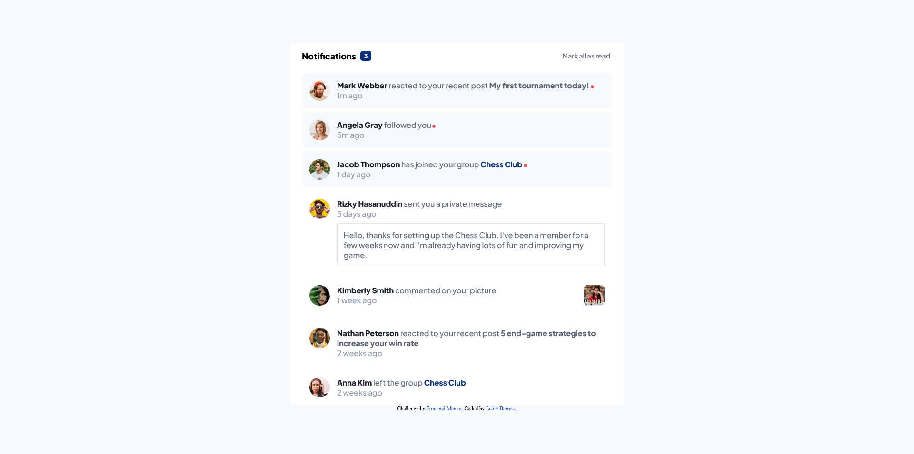

# Frontend Mentor - Notifications page solution

This is a solution to the [Notifications page challenge on Frontend Mentor](https://www.frontendmentor.io/challenges/notifications-page-DqK5QAmKbC). Frontend Mentor challenges help you improve your coding skills by building realistic projects. 

## Table of contents

- [Overview](#overview)
  - [The challenge](#the-challenge)
  - [Screenshot](#screenshot)
  - [Links](#links)
- [My process](#my-process)
  - [Built with](#built-with)
  - [What I learned](#what-i-learned)

## Overview

### The challenge

Users should be able to:

- Distinguish between "unread" and "read" notifications
- Select "Mark all as read" to toggle the visual state of the unread notifications and set the number of unread messages to zero
- View the optimal layout for the interface depending on their device's screen size
- See hover and focus states for all interactive elements on the page

### Screenshot




### Links

- Solution URL: [https://github.com/javierb256/Notifications-page](https://github.com/javierb256/Notifications-page)
- Live Site URL: [https://javierb256.github.io/Notifications-page/](https://javierb256.github.io/Notifications-page/)

## My process

### Built with

- Semantic HTML5 markup
- CSS custom properties
- Flexbox
- [TypeScript](https://www.typescriptlang.org/) - TS library


### What I learned

I started to learn how to use TypeScript and so I wanted to implement it into this project. The main place where I used it was to correctly type the DOM element that the user would be working with. For example, I typed the button that the user would click to mark all of their messages as read as a HTMLButtonElement type. I also added a "!" at the end to let TypeScript know that the element will always be present no matter what.

```ts
const markAllButton = document.querySelector<HTMLButtonElement>("button")!;

```
